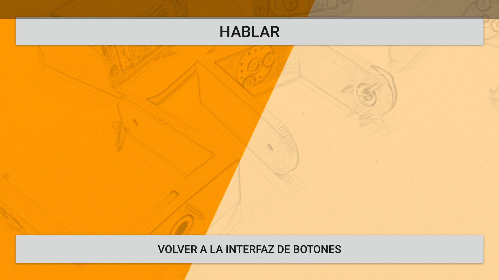

# App Android para Zowi impreso en 3D

## En este fork

Hemos añadido a la app control por gestos: inclina el teléfono en la dirección en la que quieres que se mueva Zowi para controlarlo y mándale órdenes por voz para que haga los siguientes pasos de baile:

* Michael Jackson (izquierda o derecha)
* Crusaito (izquierda o derecha)
* Saltar
* Swing
* Y parar!

Have fun!
